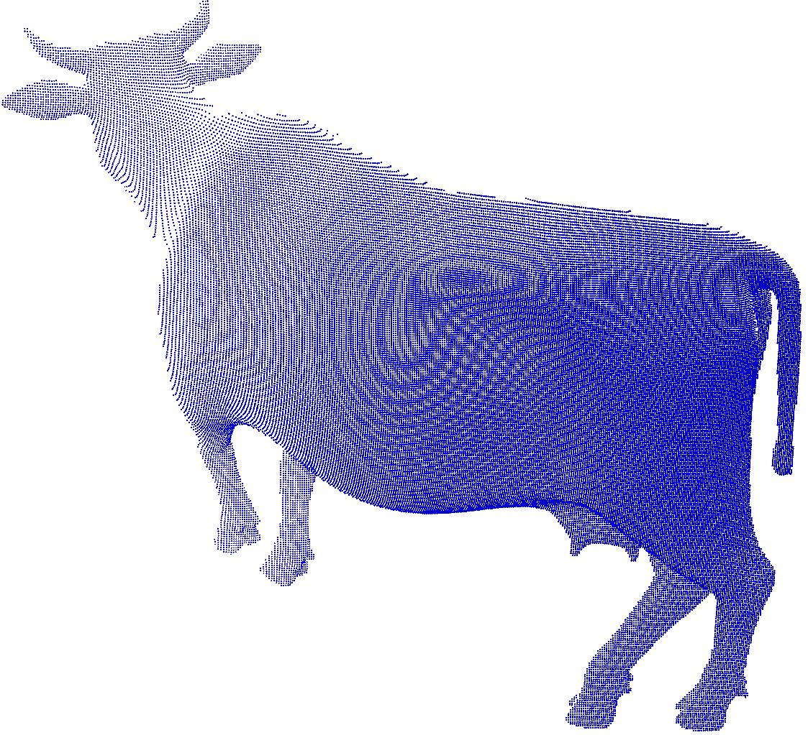
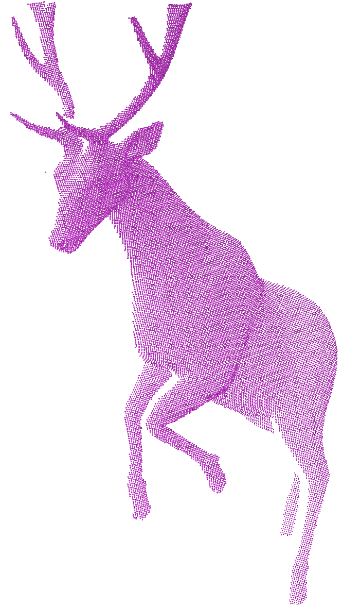

# CasCat-Net
    Paper | Code 

# Demos
    to be updated

# Installation
## Method 1: Using Docker (Recommended)
    to be updated

## Method 2: Using Conda
    to be updated

## Data and Pretrained Model
    to be updated

# Training
## Method 1: Using Docker (Recommended)
    to be updated

## Method 2: Using Conda
    to be updated

# Evaluation
## Method 1: Using Docker (Recommended)
    to be updated

## Method 2: Using Conda
    to be updated

# Acknowledgement
    to be updated

# Citation
    to be updated